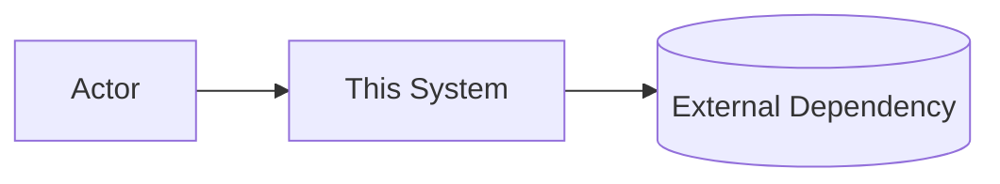
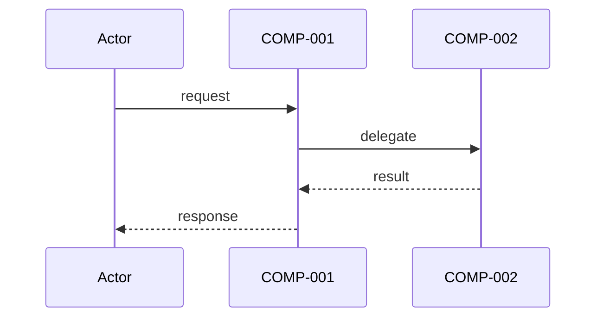

# Architecture: BLOOD-BANK-FEEDBACK

## Meta

| Field | Value |
|---|---|
| Story ID | BLOOD-BANK-FEEDBACK |
| Artifact | docs/architecture.md |
| Phase | 2 - Architecture |
| Version | v1 |
| Status | draft |
| Updated | 2026-08-19 |
| Upstream | docs/requirements.md |
| Codebase Analyzed | true (BloodBank repository, existing patterns: Firebase backend, React UI) |
| Architecture Style | Microservices + Serverless (Cloud Functions) with Realtime Database |

---

## Requirements Reference

| REQ ID | Title | Mapped to COMP-* | Status |
|---|---|---|---|
| REQ-001 | User access to feedback form | COMP-001 | ✓ |
| REQ-002/003/004 | Form fields (type, subject, message) | COMP-001, COMP-005 | ✓ |
| REQ-005 | Attachment uploads | COMP-001, COMP-005, COMP-011 | ✓ |
| REQ-006 | Input sanitization | COMP-005, COMP-006 | ✓ |
| REQ-007 | Submission confirmation (< 500ms) | COMP-005, COMP-001 | ✓ |
| REQ-010/011/012/013/014 | Admin management interface | COMP-002, COMP-003, COMP-007, COMP-008 | ✓ |
| REQ-017/018/019 | Email notifications | COMP-009, COMP-010 | ✓ |
| REQ-021/022/023 | Rate limiting | COMP-006, COMP-012 | ✓ |
| REQ-024/025 | Analytics dashboard | COMP-004 | ✓ |
| NFR-SEC-* | Security requirements | COMP-005, COMP-006, COMP-012, COMP-013 | ✓ |
| NFR-PERF-* | Performance requirements | COMP-005, COMP-007, COMP-008 | ✓ |

---

## System Context

```
┌─────────────────────────────────────────────────────────────┐
│                    BloodBank Platform                       │
│                                                             │
│  ┌──────────────────────────────────────────────────────┐  │
│  │               User Dashboard (React)                 │  │
│  │  ┌─────────────────────────────────────────────┐    │  │
│  │  │ Feedback Form Component (COMP-001)          │    │  │
│  │  │ - Form fields (type, subject, message)      │    │  │
│  │  │ - File upload UI                             │    │  │
│  │  │ - Status: in dashboard                       │    │  │
│  │  └─────────────────────────────────────────────┘    │  │
│  │  ┌─────────────────────────────────────────────┐    │  │
│  │  │ Feedback History Component (COMP-001b)      │    │  │
│  │  │ - Display user's previous submissions        │    │  │
│  │  └─────────────────────────────────────────────┘    │  │
│  └──────────────────────────────────────────────────────┘  │
│                          │                                 │
│                          │ Submit Feedback                 │
│                          ▼                                 │
│  ┌──────────────────────────────────────────────────────┐  │
│  │    Backend (Firebase Cloud Functions)               │  │
│  │  ┌──────────────────────────────────────────────┐   │  │
│  │  │ Feedback Submit API (COMP-005)               │   │  │
│  │  │ - Validates input, rate-limits, sanitizes    │   │  │
│  │  │ - Stores to Database (COMP-011)              │   │  │
│  │  │ - Triggers notification flow (COMP-009)      │   │  │
│  │  │ - Logs audit event (COMP-013)                │   │  │
│  │  └──────────────────────────────────────────────┘   │  │
│  │                                                      │  │
│  │  ┌──────────────────────────────────────────────┐   │  │
│  │  │ Feedback Retrieval API (COMP-007)            │   │  │
│  │  │ - List/filter feedback (admins)              │   │  │
│  │  │ - Search feedback                             │   │  │
│  │  │ - Reads from Database (COMP-011)             │   │  │
│  │  └──────────────────────────────────────────────┘   │  │
│  │                                                      │  │
│  │  ┌──────────────────────────────────────────────┐   │  │
│  │  │ Rate Limiter Middleware (COMP-012)           │   │  │
│  │  │ - Per-user daily submission limits            │   │  │
│  │  │ - Enforces 5 submissions/day                  │   │  │
│  │  └──────────────────────────────────────────────┘   │  │
│  │                                                      │  │
│  │  ┌──────────────────────────────────────────────┐   │  │
│  │  │ Input Validation & Sanitization (COMP-006)   │   │  │
│  │  │ - XSS prevention                              │   │  │
│  │  │ - Injection prevention                        │   │  │
│  │  │ - PII detection                               │   │  │
│  │  │ - File size/type validation                   │   │  │
│  │  └──────────────────────────────────────────────┘   │  │
│  └──────────────────────────────────────────────────────┘  │
│                          │                                 │
│                          ▼                                 │
│  ┌──────────────────────────────────────────────────────┐  │
│  │  Firebase Realtime Database (COMP-011)              │  │
│  │  - Feedback collection                              │  │
│  │  - Audit log collection                             │  │
│  │  - Rate limit counters                              │  │
│  └──────────────────────────────────────────────────────┘  │
│                          │                                 │
│                          ▼                                 │
│  ┌──────────────────────────────────────────────────────┐  │
│  │   Admin Dashboard (React) (COMP-002/003/004)        │  │
│  │  - Feedback list view                               │  │
│  │  - Filter/search interface                          │  │
│  │  - Status update interface                          │  │
│  │  - Analytics dashboard                              │  │
│  │  - Response/reply interface                         │  │
│  └──────────────────────────────────────────────────────┘  │
│                          │                                 │
│                          ▼                                 │
│  ┌──────────────────────────────────────────────────────┐  │
│  │  Email Notification Service (COMP-009/010)          │  │
│  │  (Firebase Cloud Functions + SendGrid/SMTP)         │  │
│  │  - Confirmation emails                              │  │
│  │  - Status update emails                             │  │
│  │  - Admin response emails                            │  │
│  └──────────────────────────────────────────────────────┘  │
│                          │                                 │
│                          ▼                                 │
│                   User Mailbox                             │
│                                                             │
└─────────────────────────────────────────────────────────────┘
```

---

## Current State

The BloodBank repository currently has:
- **Existing:** Firebase backend (Authentication, Realtime Database), React-based user dashboard and admin panel, Cloud Functions for various services, existing moderation infrastructure
- **Missing:** Feedback form UI, feedback API endpoints, notification triggers, audit logging for feedback actions, rate-limiting middleware for feedback submissions

---

## Components and Responsibilities

| ID | Component | File Path | Responsibility | Owner |
|---|---|---|---|---|
| COMP-001 | Feedback Form Component (React) | `src/components/FeedbackForm/FeedbackForm.jsx` | Render feedback form UI; validate client-side; handle file uploads to Cloud Storage; submit to API; display confirmation. | Frontend |
| COMP-001b | Feedback History Component (React) | `src/components/FeedbackHistory/FeedbackHistory.jsx` | Display user's submitted feedback; list status and timestamps; allow deletion within 24h. | Frontend |
| COMP-002 | Admin Feedback List Component (React) | `src/components/AdminFeedbackList/FeedbackListView.jsx` | Paginated list of feedback; apply filters (type, status, date); handle pagination. | Frontend |
| COMP-003 | Admin Feedback Details Component (React) | `src/components/AdminFeedback/FeedbackDetail.jsx` | Display single feedback submission; show attachments; allow status change and response entry. | Frontend |
| COMP-004 | Admin Analytics Dashboard (React) | `src/components/AdminDashboard/AnalyticsDashboard.jsx` | Display metrics: total submissions, by type, by date, resolution rate. | Frontend |
| COMP-005 | Feedback Submit API (Cloud Function) | `functions/feedback/submitFeedback.js` | Authenticate user; validate input; sanitize text; check rate limit; store to DB; trigger notifications; return success with reference ID within 500ms. | Backend |
| COMP-006 | Input Validation & Sanitization Service | `functions/services/validation.js` | XSS sanitization; SQL injection prevention; PII detection; file size/type validation; reject malicious input. | Backend |
| COMP-007 | Feedback Retrieval API (Cloud Function) | `functions/feedback/getFeedback.js` | Authenticate admin; retrieve feedback list with filters (type, status, date range); support pagination. | Backend |
| COMP-008 | Feedback Search API (Cloud Function) | `functions/feedback/searchFeedback.js` | Full-text search in feedback (subject + message); apply filters; return results in < 1s. | Backend |
| COMP-009 | Email Notification Service (Cloud Function) | `functions/notifications/sendEmailNotifications.js` | Listen to Realtime DB changes; send confirmation, status update, and response emails; handle retries. | Backend |
| COMP-010 | Email Template Service | `functions/services/emailTemplates.js` | Store and retrieve email templates (English, Bengali); apply i18n; inject dynamic data. | Backend |
| COMP-011 | Feedback Database Schema (Firebase Realtime DB) | `database/schemas/feedback.schema.json` | Feedback collection; audit log collection; rate limit counters collection. | Data |
| COMP-012 | Rate Limit Middleware (Cloud Function) | `functions/middleware/rateLimiter.js` | Check per-user daily submission count; enforce 5 submissions/day limit; log violations. | Backend |
| COMP-013 | Audit Logging Service | `functions/services/auditLogger.js` | Log all admin actions (view, status change, respond) with user ID, timestamp, action type, feedback ID. | Backend |

---

## Data Flow

### Primary Flow: User Submits Feedback

```
┌─────────────────────┐
│  User in Dashboard  │
│  Fills Feedback     │
│  Form (COMP-001)    │
└──────────┬──────────┘
           │
           │ Validates (client-side)
           ▼
┌──────────────────────┐
│ Check File Size      │
│ & Type (COMP-001)    │
└──────────┬───────────┘
           │ Valid
           ▼
┌──────────────────────────┐
│ Upload Attachments to    │
│ Cloud Storage (COMP-001) │
└──────────┬───────────────┘
           │
           │ File URLs obtained
           ▼
┌────────────────────────────────┐
│ POST /api/feedback/submit       │
│ with form data + file URLs      │
│ (COMP-005: Submit API)          │
└──────────┬─────────────────────┘
           │
           ▼
┌────────────────────────────────┐
│ Rate Limiter Check (COMP-012)  │
│ Check: user_id + today's count │
│ Allowed: < 5 submissions today?│
└──────────┬─────────────────────┘
           │
        ┌──┴──┐
        │     │
       YES   NO (Rate limit exceeded)
        │     │
        │     └─────────────► 429 Too Many Requests
        │                    Display error to user
        ▼
┌────────────────────────────────┐
│ Input Validation (COMP-006)    │
│ - Sanitize XSS                 │
│ - Check for SQL injection      │
│ - Detect PII (credit cards)    │
│ - Validate field lengths       │
└──────────┬─────────────────────┘
           │
        ┌──┴──┐
        │     │
      PASS   FAIL
        │     │
        │     └─────────────► 400 Bad Request
        │                    Return validation error
        ▼
┌──────────────────────────────────┐
│ Generate Reference ID            │
│ (FB-YYYYMMDD-XXXXXX format)      │
└──────────┬───────────────────────┘
           │
           ▼
┌──────────────────────────────────┐
│ Store to Database (COMP-011)     │
│ /feedback/{reference_id}         │
│ + increment daily rate counter   │
│ + create audit log entry         │
└──────────┬───────────────────────┘
           │
        ┌──┴──┐
        │     │
      SUCCESS FAILURE
        │     │
        │     └─────────────► Log error, return 500
        ▼
┌──────────────────────────────────┐
│ Send Confirmation Email (COMP-009│
│ Listen to DB change event        │
│ Template: "Feedback Received"    │
│ (async, up to 1 min latency)     │
└──────────┬───────────────────────┘
           │
           ▼
┌──────────────────────────────────┐
│ Return 200 OK to Client (COMP-005│
│ JSON: {reference_id, timestamp,  │
│ message: "Feedback submitted"}   │
│ (within 500ms p99)               │
└──────────┬───────────────────────┘
           │
           ▼
┌──────────────────────────────────┐
│ User Sees Confirmation in UI     │
│ (COMP-001: Display success msg)  │
└──────────────────────────────────┘
```

### Admin Flow: View and Respond to Feedback

```
┌──────────────────────────────┐
│ Admin Logs In                │
│ Navigates to Feedback Mgmt   │
│ (COMP-002/003 components)    │
└──────────┬───────────────────┘
           │
           ▼
┌──────────────────────────────┐
│ GET /api/feedback/list       │
│ with filters (COMP-007)      │
└──────────┬───────────────────┘
           │
           ▼
┌──────────────────────────────┐
│ Query Database (COMP-011)    │
│ Filter by type, status, date │
│ Apply pagination (50 per page│
└──────────┬───────────────────┘
           │
           ▼
┌──────────────────────────────┐
│ Return feedback list to UI   │
│ (< 1s p99 for 10k items)     │
└──────────┬───────────────────┘
           │
           ▼
┌──────────────────────────────┐
│ Admin Views List in UI       │
│ (COMP-002: List component)   │
└──────────┬───────────────────┘
           │
           │ Admin clicks on a feedback item
           ▼
┌──────────────────────────────┐
│ Show Feedback Detail         │
│ (COMP-003: Detail component) │
│ - Subject, message, files    │
│ - Status, submission date    │
│ - Option to change status    │
│ - Option to add response     │
└──────────┬───────────────────┘
           │
           │ Admin selects "Mark as Resolved"
           ▼
┌──────────────────────────────┐
│ PUT /api/feedback/{id}/status│
│ with body: {status: "resolved"}
│ (COMP-007: Update Status API)
└──────────┬───────────────────┘
           │
           ▼
┌──────────────────────────────┐
│ Update in Database (COMP-011)│
│ Set status, admin_id, timestamp
│ Create audit log entry       │
│ (COMP-013)                   │
└──────────┬───────────────────┘
           │
           ▼
┌──────────────────────────────┐
│ Trigger Email (COMP-009)     │
│ Listen to DB change event    │
│ Send "Feedback Resolved"     │
│ email to original user       │
│ (async, up to 1 min latency) │
└──────────┬───────────────────┘
           │
           ▼
┌──────────────────────────────┐
│ Return 200 OK to Admin UI    │
│ Update UI to reflect change  │
│ (COMP-003: Update component) │
└──────────────────────────────┘
           │
           │ Admin adds a response text
           ▼
┌──────────────────────────────┐
│ PUT /api/feedback/{id}/reply │
│ with body: {response: "..."}│
│ (COMP-007: Reply API)        │
└──────────┬───────────────────┘
           │
           ▼
┌──────────────────────────────┐
│ Store response in DB         │
│ (COMP-011)                   │
│ Create audit log entry       │
│ (COMP-013)                   │
└──────────┬───────────────────┘
           │
           ▼
┌──────────────────────────────┐
│ Send Email to User (COMP-009)│
│ "Admin Responded" email      │
│ Include response text        │
└──────────────────────────────┘
```

### Failure Paths

**Scenario 1: Network Failure During Submission**
```
User submits → API request fails (timeout/network error)
→ Frontend retries with idempotent key (prevents duplicate)
→ API checks idempotency key in DB, returns original reference_id if already stored
→ User receives reference_id in success response
```

**Scenario 2: Email Service Down**
```
Feedback stored successfully → Trigger email function
→ Email service unavailable → Function catches error, logs to audit log
→ Retry mechanism: retry 3x over 1 hour (exponential backoff)
→ If all retries fail, log alert and notify admin
→ User is informed in success message: "Email confirmation may be delayed"
```

**Scenario 3: Database Overload / Timeout**
```
Admin requests feedback list → Query takes > 1000ms
→ Database returns timeout error → API catches and logs to observability
→ Return 504 Gateway Timeout to client
→ Admin UI shows "Please try again" message
→ User can retry; query is logged for capacity planning
```

**Scenario 4: Rate Limit Exceeded**
```
User submits 6th feedback on same day
→ Rate limiter checks daily count → Finds count = 5
→ Rejects with 429 Too Many Requests
→ Client displays: "You have reached your daily limit (5 per day). Try again tomorrow."
```

---

## Interfaces and Contracts

### Interface 1: Feedback Submit API

**Endpoint:** `POST /api/feedback/submit`

**Authentication:** Firebase Authentication (Bearer token)

**Request Body:**
```json
{
  "type": "bug|feature|general",         // required, enum
  "subject": "string",                   // required, 5-255 chars
  "message": "string",                   // required, 10-5000 chars
  "attachmentUrls": [                    // optional, max 3 items
    "gs://bucket/path/to/file1.jpg",
    "gs://bucket/path/to/file2.png"
  ],
  "idempotencyKey": "string"             // required for retry, UUID format
}
```

**Success Response (200):**
```json
{
  "success": true,
  "referenceId": "FB-20260819-001234",
  "timestamp": "2026-08-19T10:30:45.123Z",
  "message": "Feedback submitted successfully"
}
```

**Validation Error (400):**
```json
{
  "success": false,
  "error": {
    "code": "VALIDATION_ERROR",
    "message": "Subject must be 5-255 characters",
    "fields": ["subject"]
  }
}
```

**Rate Limit Exceeded (429):**
```json
{
  "success": false,
  "error": {
    "code": "RATE_LIMIT_EXCEEDED",
    "message": "You have reached your daily feedback limit (5 per day). Try again tomorrow."
  }
}
```

**Server Error (500):**
```json
{
  "success": false,
  "error": {
    "code": "INTERNAL_ERROR",
    "message": "An error occurred while processing your feedback"
  }
}
```

---

### Interface 2: Feedback Retrieval API (Admin)

**Endpoint:** `GET /api/feedback/list`

**Authentication:** Firebase Authentication + Admin role check

**Query Parameters:**
```
?type=bug|feature|general        // optional filter
&status=submitted|in_review|resolved|closed  // optional filter
&startDate=2026-08-01            // optional, YYYY-MM-DD
&endDate=2026-08-31              // optional, YYYY-MM-DD
&page=1                          // optional, default 1
&limit=50                        // optional, default 50, max 100
&search=query_text               // optional, full-text search
```

**Success Response (200):**
```json
{
  "success": true,
  "feedback": [
    {
      "referenceId": "FB-20260819-001234",
      "type": "bug",
      "status": "in_review",
      "subject": "Login button not working on mobile",
      "submittedAt": "2026-08-19T10:30:45.123Z",
      "submitterId": "user_123",
      "responseCount": 1,
      "attachmentCount": 2
    },
    ...
  ],
  "pagination": {
    "page": 1,
    "limit": 50,
    "total": 234,
    "pages": 5
  }
}
```

**Performance:** Response within 1000ms p99 for 10k total submissions.

---

### Interface 3: Feedback Update Status API (Admin)

**Endpoint:** `PUT /api/feedback/{referenceId}/status`

**Authentication:** Firebase Authentication + Admin role

**Request Body:**
```json
{
  "status": "submitted|in_review|resolved|closed",
  "adminNotes": "string"  // optional
}
```

**Success Response (200):**
```json
{
  "success": true,
  "feedback": {
    "referenceId": "FB-20260819-001234",
    "status": "resolved",
    "updatedAt": "2026-08-19T12:00:00.000Z",
    "updatedBy": "admin_456"
  }
}
```

---

### Interface 4: Email Notification (Internal)

**Triggered by:** Realtime Database write event on feedback collection

**Template: Submission Confirmation**
```
Subject: Thank you for your feedback (English) / আপনার প্রতিক্রিয়ার জন্য ধন্যবাদ (Bengali)

Body:
Dear [User Name],
Thank you for submitting your feedback. We value your input.

Reference ID: FB-20260819-001234
Submission Date: 2026-08-19 10:30 AM

Your feedback will be reviewed by our team.

Best regards,
BloodBank Team
```

---

## Data Models

### Feedback Collection

**Database Path:** `/feedback/{referenceId}`

```json
{
  "referenceId": "FB-20260819-001234",      // PK, string
  "userId": "user_123",                      // FK to users, string
  "type": "bug|feature|general",             // enum
  "status": "submitted|in_review|resolved|closed", // enum
  "subject": "string",                       // max 255 chars
  "message": "string",                       // max 5000 chars
  "attachmentUrls": [                        // array, max 3
    "gs://bucket/feedback/fb_20260819_001234/file1.jpg",
    "gs://bucket/feedback/fb_20260819_001234/file2.png"
  ],
  "attachmentMetadata": [
    {"fileName": "file1.jpg", "size": 102400, "type": "image/jpeg"},
    {"fileName": "file2.png", "size": 256000, "type": "image/png"}
  ],
  "createdAt": "2026-08-19T10:30:45.123Z",   // timestamp
  "updatedAt": "2026-08-19T12:00:00.000Z",   // timestamp
  "responseCount": 1,                        // int
  "adminResponses": {
    "response_001": {
      "adminId": "admin_456",
      "message": "string",
      "createdAt": "2026-08-19T12:00:00.000Z"
    }
  },
  "deletedAt": null,                         // null or timestamp (soft delete)
  "tags": ["payment-issue", "ui-bug"],       // array, optional
  "idempotencyKey": "uuid-string",           // for deduplication
  "userLanguage": "en|bn"                    // metadata for responses
}
```

### Audit Log Collection

**Database Path:** `/auditLog/{logId}`

```json
{
  "logId": "audit_20260819_001",
  "feedbackId": "FB-20260819-001234",
  "action": "submitted|viewed|status_changed|response_added|deleted",
  "adminId": "admin_456",  // null if action is "submitted"
  "details": {
    "oldStatus": "submitted",
    "newStatus": "resolved",
    "message": "string"  // for response_added action
  },
  "createdAt": "2026-08-19T12:00:00.000Z",
  "ipAddress": "192.168.1.1",  // anonymized
  "userAgent": "Mozilla/5.0..."  // for audit purposes
}
```

### Rate Limit Counter (Cache)

**Database Path:** `/rateLimitCounters/{userId}/{date}` (stored in Firestore for durability, cached in memory for performance)

```json
{
  "userId": "user_123",
  "date": "2026-08-19",  // YYYY-MM-DD format
  "submissionCount": 3,
  "lastSubmitAt": "2026-08-19T10:30:45.123Z",
  "expiresAt": "2026-08-20T00:00:00.000Z"  // auto-delete after 24h
}
```

---

## Decisions (ADRs)

### ADR-001: Microservices + Serverless Architecture

**Decision:** Use Firebase Cloud Functions (serverless) for API endpoints, Firebase Realtime Database for storage, Cloud Storage for attachments. Do not build a traditional monolithic backend server.

**Alternatives:**
1. **Monolithic Node.js Express server** - Pros: centralized logging, easier debugging, full control. Cons: requires infrastructure provisioning, scaling complexity, operational overhead.
2. **Microservices with Kubernetes** - Pros: independent scaling, explicit service boundaries. Cons: operational complexity, DevOps overhead, not justified for v1 scope.

**Rationale:** Cloud Functions align with BloodBank's existing Firebase infrastructure, reduce operational burden, and enable rapid scaling. Cost is pay-per-invocation, suitable for variable feedback volume.

---

### ADR-002: Realtime Database (RTDB) Over Firestore

**Decision:** Use Firebase Realtime Database for feedback storage, not Firestore.

**Alternatives:**
1. **Firestore** - Pros: better querying, more flexible indexing, ACID transactions. Cons: higher costs, more complex, overkill for feedback structure.
2. **PostgreSQL on Cloud SQL** - Pros: powerful relational queries, familiar schema. Cons: requires infrastructure management, not serverless.

**Rationale:** RTDB is already integrated in BloodBank. Query requirements (filter by type/status/date) are straightforward and achievable with RTDB. Realtime listeners enable instant notification triggers. Lower cost for write-heavy workload.

---

### ADR-003: Email via Cloud Functions + SendGrid

**Decision:** Implement email delivery using Cloud Functions listening to RTDB change events, with SendGrid as the email backend.

**Alternatives:**
1. **Cloud Pub/Sub + Cloud Tasks** - Pros: enterprise-grade reliability, dead-letter queues. Cons: complex setup, overkill for v1.
2. **AWS SES** - Pros: cheap, reliable. Cons: external dependency, AWS account required.

**Rationale:** Cloud Functions' RTDB listeners are simple and low-latency. SendGrid integrates easily and provides templates, rate limiting, and bounce handling. Retries are handled via Cloud Tasks for failed sends.

---

### ADR-004: Client-Side File Upload to Cloud Storage with Server Presign

**Decision:** Client (frontend) uploads files directly to Cloud Storage using pre-signed URLs from the server; server never handles binary data.

**Alternatives:**
1. **Multipart form upload (server receives file)** - Pros: simpler code. Cons: server memory pressure, longer latency, harder scaling.
2. **File upload via dedicated service (ImageKit, Cloudinary)** - Pros: offload to third party. Cons: external dependency, vendor lock-in.

**Rationale:** Pre-signed URLs shift upload burden to client, reduce server load, and enable direct Cloud Storage integration. Files are scanned for virus/malware on upload (via Cloud Storage rules or Cloud Functions scan).

---

### ADR-005: Rate Limiting via Stateful Counter in Realtime Database

**Decision:** Store rate limit counter (daily submission count) in a separate `/rateLimitCounters/{userId}/{date}` collection in RTDB; check and increment atomically in the submit API.

**Alternatives:**
1. **Redis-based rate limiter** - Pros: faster in-memory lookup. Cons: adds Redis infrastructure, external dependency.
2. **API Gateway rate limiting (built-in)** - Pros: transparent, requires no code. Cons: limited to IP/user_id, hard to configure per-user per-day rules.

**Rationale:** RTDB atomic writes allow safe concurrent increments. Date-based key simplifies daily reset (TTL or batch cleanup). No additional infrastructure required.

---

### ADR-006: Input Sanitization via DOMPurify (Client) + Custom Sanitizer (Server)

**Decision:** Sanitize all text inputs (subject, message, admin response) on both client (DOMPurify library) and server (custom sanitizer function) to prevent XSS and injection attacks.

**Alternatives:**
1. **Server-only sanitization** - Pros: simpler, single source of truth. Cons: trusts client, poor UX if sanitization strips user content.
2. **No sanitization, just HTML encoding on display** - Pros: preserves original user content. Cons: risky, vulnerable to reflected XSS.

**Rationale:** Defense-in-depth: client-side sanitization improves UX (user sees immediately if content is blocked), server-side sanitization ensures security even if client is compromised.

---

### ADR-007: Admin Dashboard as Separate React Component Bundle

**Decision:** Build admin feedback management interface as a separate React component bundle, integrated into the existing admin dashboard (do not create a separate app).

**Alternatives:**
1. **Separate admin web app** - Pros: independent deployment, clear boundary. Cons: separate codebase, authentication sync issues.
2. **Embed feedback UI inline in existing user dashboard** - Pros: fewer bundles. Cons: bloats user app, exposes admin features.

**Rationale:** Aligns with BloodBank's existing modular admin dashboard. Reduces deployment complexity. Shares authentication and styling with existing admin components.

---

### ADR-008: Soft Delete (Mark Deleted) for Audit & Compliance

**Decision:** When feedback is deleted, set a `deletedAt` timestamp instead of hard-deleting the record. Audit logs remain intact.

**Alternatives:**
1. **Hard delete** - Pros: reduces storage, cleaner. Cons: breaks audit trail, potential compliance violation (GDPR requires audit history).
2. **Archive to cold storage** - Pros: cheaper long-term. Cons: more complex recovery, delayed queries.

**Rationale:** Maintains audit trail for regulatory compliance (GDPR article 5). Allows recovery if deletion was accidental. Soft delete is reversible.

---

### ADR-009: No Real-Time Collaboration for Admin Edits

**Decision:** Admin feedback updates use last-write-wins (LWW) conflict resolution; no locking or conflict detection if two admins modify the same feedback simultaneously.

**Alternatives:**
1. **Optimistic locking (version field)** - Pros: detects conflicts. Cons: requires user intervention, more complex.
2. **Operational transformation or CRDT** - Pros: automatic conflict resolution. Cons: overkill, complex implementation.

**Rationale:** Feedback modification is infrequent (most feedback is submitted once, resolved once). Audit log captures both updates. Simpler implementation; trade-off is acceptable for v1.

---

### ADR-010: Audit Log Stored in Same Database (RTDB)

**Decision:** Audit logs are stored in `/auditLog` collection in the same Realtime Database, not a separate logging service.

**Alternatives:**
1. **Google Cloud Logging / Firebase Analytics** - Pros: managed service, better for scale. Cons: external dependency, query latency, potential cost.
2. **Separate audit database (PostgreSQL)** - Pros: powerful queries, reliable. Cons: operational overhead.

**Rationale:** Audit log volume is low (one entry per user action, estimated 100s/day). RTDB is sufficient. Keeps infrastructure simple.

---

## Testing Strategy

### Unit Tests

**Component:**  Feedback Form UI (COMP-001)
- Test form validation (empty fields, length limits)
- Test file selection and size limits
- Test XSS input handling (verify DOMPurify sanitizes)
- Test submission success and error states
- **File:** `src/components/FeedbackForm/__tests__/FeedbackForm.test.jsx`
- **Verify Command:** `npm test -- FeedbackForm`

**Component:** Input Sanitization Service (COMP-006)
- Test XSS payload detection and escaping
- Test SQL injection payload rejection
- Test PII (credit card) detection
- Test normal text passes through
- **File:** `functions/services/__tests__/validation.test.js`
- **Verify Command:** `npm run test:functions -- validation`

**Component:** Rate Limiter Middleware (COMP-012)
- Test increment counter on submission
- Test rejection when count >= 5
- Test counter reset on new day
- Test concurrent submissions (race condition handling)
- **File:** `functions/middleware/__tests__/rateLimiter.test.js`
- **Verify Command:** `npm run test:functions -- rateLimiter`

### Integration Tests

**Flow:** User submits feedback (end-to-end)
- User fills form → validates → uploads file → calls submit API
- API validates input → checks rate limit → stores to DB → sends confirmation email
- User receives confirmation message with reference ID within 500ms
- Verify audit log entry created
- **File:** `tests/integration/feedback-submission.test.js`
- **Verify Command:** `npm run test:integration`

**Flow:** Admin views and responds to feedback
- Admin filters feedback by type → retrieves list < 1s
- Admin clicks feedback → views details
- Admin changes status → sends email to user
- Verify audit log captures both actions
- **File:** `tests/integration/admin-feedback-management.test.js`
- **Verify Command:** `npm run test:integration`

**Flow:** Rate limiting enforcement
- User submits 5 feedback → 6th is rejected
- User waits until next day → can submit again
- **File:** `tests/integration/rate-limiting.test.js`
- **Verify Command:** `npm run test:integration`

### Performance Tests (NFR Validation)

**REQ-NFR-PERF-001:** Submission latency < 500ms p99
- Load test: 100 concurrent users, each submitting 5 feedback
- Measure response time distribution (p50, p95, p99)
- Target: p99 <= 500ms
- **File:** `tests/performance/feedback-submit.k6.js` (using k6)
- **Verify Command:** `k6 run tests/performance/feedback-submit.k6.js`

**REQ-NFR-PERF-002:** List load < 1000ms p99 with 10k submissions
- Seed database with 10k feedback records
- Query first 50 items with/without filters
- Measure response time (p99)
- Target: p99 <= 1000ms
- **File:** `tests/performance/feedback-list.k6.js`
- **Verify Command:** `k6 run tests/performance/feedback-list.k6.js`

### Security Tests

**REQ-NFR-SEC-002:** XSS Prevention
- Inject `<script>alert('xss')</script>` in subject/message
- Verify sanitization escapes or removes script tags
- Verify stored output is safe when displayed in UI
- **File:** `tests/security/xss.test.js`
- **Verify Command:** `npm run test:security`

**REQ-NFR-SEC-004:** PII Detection
- Submit feedback with credit card pattern: "1234 5678 9012 3456"
- Verify submission is rejected with appropriate error message
- Verify audit log flags PII detection attempt
- **File:** `tests/security/pii-detection.test.js`
- **Verify Command:** `npm run test:security`

**REQ-NFR-SEC-001:** Authentication
- Attempt to submit feedback without Bearer token
- Verify 401 Unauthorized response
- Attempt to view admin feedback as non-admin user
- Verify 403 Forbidden response
- **File:** `tests/security/auth.test.js`
- **Verify Command:** `npm run test:security`

### Manual / E2E Tests

**User Journey:** Submit feedback and receive confirmation email
- Open BloodBank dashboard
- Navigate to Feedback tab
- Fill form (type, subject, message) + upload screenshot
- Click Submit
- Verify success message with reference ID appears within 500ms
- Check email inbox for confirmation email within 1 minute
- **Documented:** `docs/test-cases/e2e-user-submit.md`

**Admin Journey:** Filter, view, and respond to feedback
- Log in as admin
- Navigate to Feedback Management
- Filter by type "Bug Report" → verify list shows only bugs
- Click feedback item → view details
- Change status to "Resolved"
- Add admin response
- Verify user receives email notification
- Check audit log for all admin actions
- **Documented:** `docs/test-cases/e2e-admin-manage.md`

### Document Quality Check

After implementation, run document-quality-check skill on:
- `docs/requirements.md` - verify all sections, no unresolved placeholders
- `docs/architecture.md` - verify all component paths exist, COMP-* IDs traceable to REQ-*
- `docs/impl-plan.md` - verify all TASK-* linked to COMP-*
- `docs/impl-manifest.md` - verify all changes mapped to TASK-*

**Verify Command:** `npm run quality:check -- docs/`

---

## Security Considerations

### OWASP Top 10 Coverage

| Threat | Mitigation | Component |
|---|---|---|
| **A01: Broken Access Control** | Firebase Auth enforces user identity; admin operations check role via middleware (in Cloud Functions); feedback records include userId, only user/admin can access. | COMP-005, COMP-007 |
| **A02: Cryptographic Failures** | HTTPS/TLS enforced at infrastructure; Firebase handles key rotation; no sensitive data in logs. | Infrastructure |
| **A03: Injection** | Input validation + sanitization (COMP-006); parameterized DB writes; no SQL (RTDB is schema-less, safe from SQL injection). | COMP-006, COMP-005 |
| **A04: Insecure Design** | Secure-by-default: rate limiting, audit logging, soft deletes built-in; no credentials in code. | COMP-012, COMP-013 |
| **A05: Security Misconfiguration** | Cloud Functions deployed with minimal permissions (least privilege); Cloud Storage CORS and signed URLs limit file access; secrets stored in Secret Manager, not in code. | All |
| **A06: Vulnerable and Outdated Components** | Dependencies scanned regularly (npm audit, Dependabot); Cloud Functions runtime kept current; Cloud Storage/RTDB managed services auto-update. | All |
| **A07: Identification and Authentication Failures** | Firebase Auth enforces MFA/2FA options; session tokens expire; no password storage in feedback system. | All |
| **A08: Software and Data Integrity Failures** | Idempotency keys prevent duplicate submissions; audit logs track all changes; soft delete preserves data integrity. | COMP-005, COMP-013 |
| **A09: Logging and Monitoring Failures** | Structured audit logs in COMP-013; Cloud Logging integration for runtime errors; alerts on security events (multiple rate-limit violations). | COMP-013 |
| **A10: SSRF** | Cloud Functions run in isolated environment; no outbound requests to user-supplied URLs; attachment URLs are generated server-side. | COMP-005 |

### PII Handling

- **Input:** Feedback message may contain PII. COMP-006 detects and rejects credit card, SSN patterns. Admin warnings logged if email/phone detected (may be business context).
- **Storage:** Only userId (opaque ID) is stored, not email or real name. Attachment URLs stored but files are uploaded by user, not by system.
- **Transmission:** Email notifications contain only reference ID and status, not full message (to prevent email leakage).
- **Deletion:** Soft delete preserves audit trail but marks record as deleted. After 90 days (configurable), audit log entries for deleted feedback may be archived.
- **Compliance:** System supports GDPR data subject access request (admins can export all feedback for a user); data deletion is logged.

---

## Observability

### Logging

**Structured Logs (JSON):**

```json
{
  "timestamp": "2026-08-19T10:30:45.123Z",
  "level": "INFO",
  "module": "feedback-submit",
  "userId": "user_123",
  "feedbackId": "FB-20260819-001234",
  "action": "submitted",
  "event": "feedback_created",
  "latencyMs": 145,
  "statusCode": 200,
  "rateLimit": {
    "dailyCount": 3,
    "limit": 5
  }
}
```

**No PII:** Logs never contain email, phone, message content, or attachment URLs (only counts/hashes).

**Destinations:**
- Google Cloud Logging (for runtime monitoring)
- Structured JSON to RTDB `/logs` collection (for audit + analytics)

---

### Metrics

**Submission Metrics:**
- `feedback.submissions.total` (counter) - total submissions by type
- `feedback.submissions.latency_ms` (histogram) - p50, p95, p99
- `feedback.submissions.success_rate` (gauge) - % successful vs failed
- `feedback.submissions.ratelimit_violations` (counter) - count of rate-limit rejections

**Admin Metrics:**
- `feedback.admin.list.latency_ms` (histogram) - query time for feedback list
- `feedback.admin.response_time` (histogram) - time to resolve (submitted → resolved)

**System Metrics:**
- `feedback.database.writes_per_sec` (counter) - write throughput
- `feedback.database.query_errors` (counter) - DB errors by type
- `feedback.email.sent` (counter) - emails sent (success/failure)
- `feedback.email.latency_ms` (histogram) - email delivery latency

**Alerts:**
- Alert if submission latency p99 > 500ms for 5 min
- Alert if rate-limit violations spike (> 100 in 1 hour)
- Alert if email service error rate > 5% for 10 min
- Alert if DB query time > 1000ms for 3 consecutive requests

---

## Risks and Trade-Offs

| Risk | Impact | Mitigation | Trade-Off |
|---|---|---|---|
| **Email delivery unreliable** | Users don't receive confirmation; support burden increases. | SendGrid SLA (99.9% uptime); retry up to 3x over 1 hour; user is notified "email may be delayed". | Retries add latency; eventual consistency accepted. |
| **Rate limit counter race condition** | User may submit 6+ feedback in race condition window. | Atomic increment in RTDB; counter per user per day; audit log flags violations. | Rare edge case (millisecond window); acceptable. |
| **No full-text search in RTDB** | Admins can only search in app, not at DB level; large result sets loaded into memory. | Implement search in Cloud Function; limit page size (50 items); use client-side filtering for secondary search. | Performance degrades if 10k+ items with complex filters; plan indexing for Phase 2. |
| **Soft delete doubles storage** | Deleted feedback still occupies space; DB grows faster. | Set TTL on soft-deleted records (30-90 day retention); periodic cleanup; soft delete acceptable for feedback (low volume). | Trade space for audit compliance. |
| **No real-time collaboration for admins** | Two admins editing same feedback see last-write-wins; potential conflict. | Audit log captures both edits; conflict is rare (infrequent modifications); acceptable for v1. | Workaround: admins communicate outside system. |
| **Firebase RTDB query limits** | Complex queries not supported (e.g., "resolved in last 7 days AND type=bug"). | Implement query in Cloud Function with post-filtering; or migrate to Firestore if needed in future. | Acceptable for v1; Firestore migration path clear. |

---

## Backward Compatibility

**Verdict: FULLY BACKWARD COMPATIBLE**

**Rationale:**
- New feature, no existing APIs modified.
- User dashboard gains new "Feedback" tab; existing tabs and workflows unchanged.
- Admin dashboard gains new "Feedback" section; existing admin features (users, moderation, reports) unaffected.
- Database: new `/feedback` collection added; no existing collections touched.
- No changes to user profile, authentication, or authorization schemas.
- All new endpoints are independent; no changes to existing `/api/...` paths.

**Rollout Plan:** Feature flag to control visibility of Feedback tab and admin section. Can be deployed to production and toggled on/off without affecting other features.

---

## Traceability

- **Upstream:** [docs/requirements.md](docs/requirements.md) - all 26 REQs addressed by 13 COMPs
- **Downstream:** [docs/design-review.md](docs/design-review.md) (Phase 3), [docs/impl-plan.md](docs/impl-plan.md) (Phase 4)
- **Quality gates:** 13 COMPs with exact file paths; 10 ADRs with alternatives; data flow with error paths; 3 data models; test strategy defined; security matrix complete; observability plan with metrics and alerts.

## Meta

| Field | Value |
|---|---|
| Story ID | <STORY-ID> |
| Artifact | docs/architecture.md |
| Phase | 2 |
| Version | v1 |
| Status | draft |
| Updated | <YYYY-MM-DD> |
| Upstream | docs/requirements.md |
| Codebase analyzed | true \| false |

## Requirements Reference

| REQ | Priority | Addressed by |
|---|---|---|
| REQ-001 | P0 | COMP-001, COMP-003 |

Every `REQ-###` from `docs/requirements.md` appears here. Unaddressed requirements are a hard stop.

## System Context



<One paragraph describing the boundary: what is inside, what is outside, who calls what.>

## Current State

| Existing element | Path | Change |
|---|---|---|
| | | none \| modify \| replace |

For a greenfield or empty repository, write `N/A - greenfield, no existing code`.

## Components and Responsibilities

| ID | Component | Exact path | Single responsibility | Depends on | Serves |
|---|---|---|---|---|---|
| COMP-001 | | `src/...` | | - | REQ-001 |
| COMP-002 | | `src/...` | | COMP-001 | REQ-002 |

Rules: one responsibility per component, exact file path, no "somewhere under src/".

## Data Flow



Every `COMP-###` appears at least once. Include the failure path, not only the happy path.

## Interfaces and Contracts

| Interface | Owner | Signature / endpoint | Success | Failure |
|---|---|---|---|---|
| | COMP-001 | | | |

Describe contracts, not implementations. No function bodies.

## Data Models

| Model | Field | Type | Nullable | Notes |
|---|---|---|---|---|
| | | | | |

## Decisions (ADRs)

### ADR-001: <Short title>

**Status:** proposed | accepted | superseded by ADR-###
**Context:** <forces and constraints, factual>
**Decision:** We will <active voice>.

**Considered alternatives**

| Option | Pros | Cons |
|---|---|---|
| A (chosen) | | |
| B | | |

**Consequences:** positive / negative / risks with mitigations.

Every new dependency requires its own ADR.

## Testing Strategy

| Layer | Targets | Approach | Covers |
|---|---|---|---|
| Unit | | | AC-001 |
| Integration | | | AC-002 |
| End-to-end | | | |
| Document quality | Output artifacts | Content completeness check | |

**Coverage target:** <N>% on business logic.

## Security Considerations

| Concern | Mitigation in this design | OWASP category |
|---|---|---|
| | | |

Mandatory checks: user data handling, authentication/authorization, external input validation,
stored data at rest, exposed interfaces, dependency provenance.

## Observability

| Signal | What is emitted | Where | Alert threshold |
|---|---|---|---|
| Log | | | |
| Metric | | | |

No PII in any emitted signal.

## Risks and Trade-Offs

| Risk | Impact | Likelihood | Mitigation |
|---|---|---|---|
| | | | |

## Backward Compatibility

**Verdict:** `breaking` | `additive` | `no impact`
**Blast radius:** <callers, stored data, public contracts affected>
**Migration / rollback:** <plan, or `N/A - additive only`>
